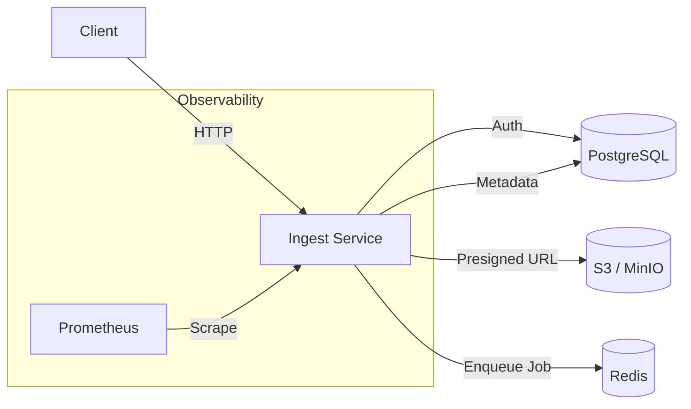

# Ingest Service

The **Ingest Service** is a production-ready, high-performance microservice designed to securely accept, process, and track log file uploads. Built with **FastAPI**, it leverages best practices in asynchronous I/O, database transaction management, and observability.

## 🚀 Key Features

### Core Functionality
- **Secure File Uploads**: Generates presigned URLs for direct-to-storage uploads (S3/MinIO), ensuring the service itself is not a bottleneck for data transfer.
- **Job Management**: Full lifecycle tracking of ingestion jobs (Created -> Queued -> Processing -> Completed/Failed).
- **Authentication & Authorization**: robust JWT-based authentication with role-based access control.

### 🛡️ Production Hardening
- **Resilience**:
    - **Database Retries**: Automatic transaction retries with exponential backoff for transient failures (deadlocks, connection drops).
    - **Connection Pooling**: Optimized SQLAlchemy pool configuration.
    - **Graceful Error Handling**: Standardized error responses and specific handling for infrastructure failures (503 Service Unavailable).
- **Observability**:
    - **Request Tracing**: `X-Request-ID` propagation across all logs and downstream calls.
    - **Structured Logging**: JSON-formatted logs in production for easy parsing by Splunk/ELK; human-readable logs in development.
    - **Metrics**: Prometheus-ready metrics exposed at `/metrics` (latency, request counts, failure rates).
- **Security**:
    - **Rate Limiting**: Intelligent limiting based on User ID (JWT) with IP fallback.
    - **Input Validation**: Strict schema validation using Pydantic.
    - **CORS Protection**: Configurable origins for production security.

## 🛠️ Architecture

The service follows a **Domain-Driven Design (DDD)** structure to ensure maintainability and separation of concerns.

- **Framework**: FastAPI (Python 3.1x)
- **Database**: PostgreSQL (Store metadata, user info, job status)
- **Queue**: Redis Stream (Decoupled job processing)
- **Storage**: S3-Compatible Object Storage (MinIO/AWS S3)



## 📦 Installation & Setup

### Prerequisites
- Python 3.11+
- PostgreSQL
- Redis
- MinIO (or AWS S3 access)
- Docker (optional, for containerized run)

### Local Development

1.  **Clone and Setup Environment**
    ```bash
    git clone <repo_url>
    cd ingest-service
    python3 -m venv .venv
    source .venv/bin/activate
    pip install -r requirements.txt
    ```

2.  **Environment Variables**
    Create a `.env` file in the root directory. See [Configuration](#configuration) below.

3.  **Run Service**
    ```bash
    uvicorn app.main:app --reload --host 0.0.0.0 --port 8000
    ```

4.  **Run Tests**
    ```bash
    pytest
    ```

### Docker

Build and run the production-ready image:

```bash
docker build -t ingest-service .
docker run -p 8000:8000 --env-file .env ingest-service
```

## ⚙️ Configuration

The service is configured via environment variables.

| Variable | Description | Default | Required in Prod |
|----------|-------------|---------|------------------|
| `ENVIRONMENT` | `development`, `staging`, `production` | `development` | ✅ |
| `DEBUG` | Enable debug logs/tracebacks | `False` | ❌ (Must be False) |
| `DATABASE_URL` | PostgreSQL Connection String | (local default) | ✅ |
| `REDIS_URL` | Redis Connection String | (local default) | ✅ |
| `S3_ENDPOINT` | URL for Object Storage | `http://ingest-minio:9000` | ✅ |
| `S3_ACCESS_KEY` | S3 Access Key ID | `minioadmin` | ✅ |
| `S3_SECRET_KEY` | S3 Secret Access Key | `minioadmin` | ✅ |
| `S3_BUCKET` | Target Bucket Name | `log-bucket` | ✅ |
| `JWT_SECRET_KEY` | Secret for signing tokens | (unsafe default) | ✅ |
| `CORS_ORIGINS` | JSON list of allowed origins | `["*"]` | ✅ |

### Key Production Settings
In `production` mode (`ENVIRONMENT=production`), the service performs self-validation on startup:
- **JWT_SECRET_KEY**: Must not be the default.
- **CORS_ORIGINS**: Must not be `*`.
- **S3 Credentials**: Must not be default MinIO keys.
- **DEBUG**: Must be `False`.

## 📊 Observability

### Metrics
Prometheus metrics are available at `GET /metrics`.
- `http_requests_total`: Total request count by method, path, and status.
- `http_request_duration_seconds`: Histogram of request latency.

### Logging
Logs are structured as JSON in production:
```json
{
  "timestamp": "2024-01-01T12:00:00Z",
  "level": "INFO",
  "message": "Job queued successfully",
  "request_id": "req-123-abc",
  "job_id": "job-xyz",
  "module": "app.ingest.service"
}
```
Include `X-Request-ID` in your HTTP headers to trace requests across logs.

## 🧪 Testing

The service includes a comprehensive test suite (Unit + Integration).

```bash
# Run all tests
pytest

# Run with coverage
pytest --cov=app tests/
```

## 🔒 Security Best Practices implemented
1.  **Least Privilege**: Database user should only have necessary permissions.
2.  **Secret Management**: Never commit `.env` files. Use Secrets Manager in K8s/AWS.
3.  **Network Isolation**: Redis and Postgres should not be exposed publicly.

---
*Maintained by Platform Engineering Team*
